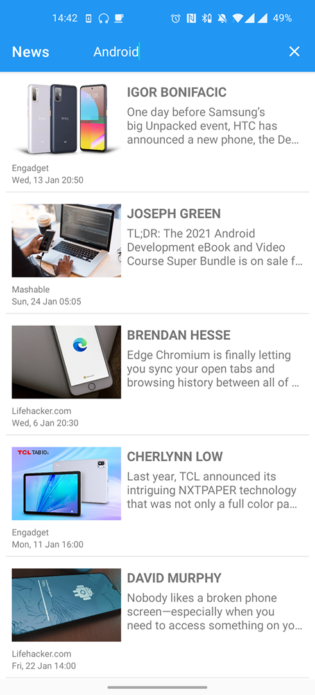

# News
### This is an example project using

  - Room component of the Android JetPack library to help with database layer abstraction (SQLite).
  - MVP architecture for separating responsibilities from the code base.
  - Coroutines with suspend functions to ensure that they are not executed in the main thread.
  - API Rest with Retrofit.
  - api https://newsapi.org/

</img>
</img>
